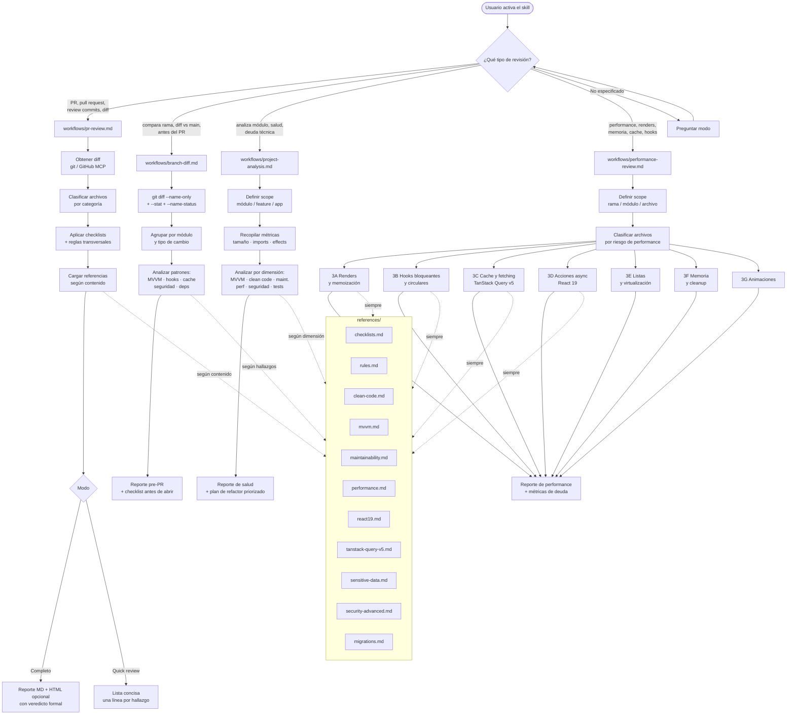

# aeromexico-code-review

Skill de revisión de código para proyectos React Native + TypeScript de Aeroméxico.
Cubre 4 modos de análisis independientes, cada uno con su propio workflow, output y nivel de granularidad.

---

## Flujo de selección



---

## Estructura

```
code-review/
├── SKILL.md                       ← Índice: detecta modo y delega al workflow
│
├── workflows/
│   ├── pr-review.md               ← Diff línea por línea + veredicto formal
│   ├── branch-diff.md             ← Patrones por módulo, análisis pre-PR
│   ├── project-analysis.md        ← Salud del módulo + métricas + plan de refactor
│   └── performance-review.md      ← Renders, memoria, cache, hooks
│
└── references/
    ├── checklists.md              ← Checklists por tipo de archivo
    ├── rules.md                   ← Reglas transversales y anti-patrones
    ├── clean-code.md              ← SRP, DRY, complejidad ciclomática
    ├── mvvm.md                    ← Flujo de datos, transformers, capas
    ├── maintainability.md         ← Navegación, RTK selectors, barrel exports
    ├── performance.md             ← FlatList, re-renders, animaciones, hooks
    ├── react19.md                 ← useTransition, useActionState, useOptimistic
    ├── tanstack-query-v5.md       ← queryOptions, useSuspenseQuery, cache
    ├── sensitive-data.md          ← PII, PCI, GDPR, OWASP
    ├── security-advanced.md       ← Deep links, WebView, tokens, permisos
    ├── migrations.md              ← Migración de framework o deps mayores
    └── html-template.md           ← Template HTML para reporte visual
```

---

## Workflows

### PR Review
**Cuándo:** al revisar un pull request o diff puntual.
**Granularidad:** línea por línea.
**Output:** reporte MD con veredicto `APROBADO ✅ / APROBADO CON OBSERVACIONES ⚠️ / REQUIERE CAMBIOS ❌` + HTML opcional.
**Modo conciso:** una línea por hallazgo con prefijos `🔴 bug` / `🟡 risk` / `🔵 nit` / `❓ q`.

Triggers: `"review este PR"`, `"review rápido"`, `"revisa el diff"`, `"review commits"`

---

### Branch Diff
**Cuándo:** antes de abrir un PR, para validar que la rama está lista.
**Granularidad:** patrones por módulo, no por línea.
**Output:** reporte con sección "Antes de abrir el PR" — lista de items a resolver.

Triggers: `"compara esta rama con main"`, `"qué cambió en esta rama"`, `"analiza esta rama antes del PR"`

---

### Project Analysis
**Cuándo:** análisis periódico de salud, antes de un sprint de refactor, o para entender la deuda de un módulo.
**Granularidad:** métricas cuantitativas + tendencias.
**Output:** tabla de métricas de salud + hallazgos por dimensión + plan de refactor priorizado por impacto/esfuerzo.

Triggers: `"analiza el módulo X"`, `"salud del código"`, `"deuda técnica"`, `"qué tan bien está escrito"`

---

### Performance Review
**Cuándo:** cuando hay sospecha de jank, re-renders excesivos, datos stale, memory leaks, o fetches lentos.
**Granularidad:** por categoría de riesgo (renders, hooks, cache, listas, memoria, animaciones).
**Output:** reporte de performance con métricas de deuda + comandos grep para detectar patrones.

Triggers: `"performance review"`, `"analiza performance"`, `"revisa renders"`, `"memory leaks"`, `"analiza el cache"`

---

## Referencias — cuándo se cargan

Las referencias no se cargan todas juntas. Cada workflow las carga solo cuando el contenido analizado las requiere.

| Referencia | Cargada por |
|------------|-------------|
| `checklists.md` | PR Review (siempre), Branch Diff (MVVM) |
| `rules.md` | PR Review (siempre), Branch Diff |
| `clean-code.md` | PR Review (funciones largas), Project Analysis |
| `mvvm.md` | PR Review (flujo de datos), Branch Diff, Project Analysis |
| `maintainability.md` | PR Review (navegación/RTK), Project Analysis |
| `performance.md` | Performance Review (siempre), PR Review (listas/animaciones) |
| `react19.md` | Performance Review (3D), PR Review (useTransition/useOptimistic) |
| `tanstack-query-v5.md` | Performance Review (3C), PR Review (useQuery/useMutation) |
| `sensitive-data.md` | PR Review (PII/PCI), Branch Diff, Project Analysis |
| `security-advanced.md` | PR Review (deep links/WebView/auth), Branch Diff |
| `migrations.md` | PR Review (deps mayores) |

---

## Severidades

| Símbolo | Significado | Acción |
|---------|-------------|--------|
| 🔴 Crítico / bug | Bug, seguridad, violación MVVM, bloqueador de compilación | Bloquea merge |
| 🟡 Importante / risk | Mantenibilidad, SOLID, lógica eliminada sin migrar, frágil | Resolver antes de merge o ticket inmediato |
| 🟢 Sugerencia / nit | Optimizaciones menores, estilo | El autor decide |
| ❓ q | Pregunta genuina, no sugerencia | Aclarar con el autor |
| ✅ Positivo | Buena práctica detectada | — |

---

## Contexto del proyecto

| Tecnología | Versión |
|------------|---------|
| React | 19.0.0 |
| React Native | 0.79.0 |
| @tanstack/react-query | 5.59.16 |
| Arquitectura | MVVM (component · controller · model · styled · transformer) |
| Estado global | Redux Toolkit + RTK Query + TanStack Query |
| Cache offline | PersistQueryClientProvider + AsyncStorage (`staleTime: Infinity` global) |
